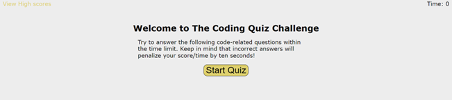
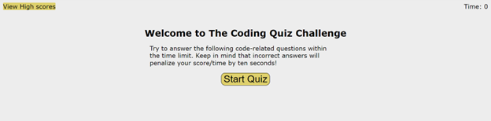
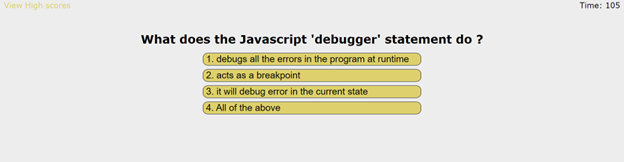
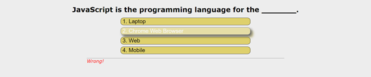
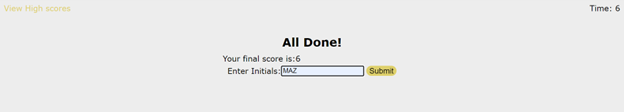
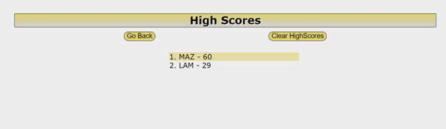

# The-Code-Quiz

## User Story
```
AS A coding boot camp student
I WANT to take a timed quiz on JavaScript fundamentals that stores high scores
SO THAT I can gauge my progress compared to my peers
```

## Acceptance Criteria
```
GIVEN I am taking a code quiz
WHEN I click the start button
THEN a timer starts and I am presented with a question
WHEN I answer a question
THEN I am presented with another question
WHEN I answer a question incorrectly
THEN time is subtracted from the clock
WHEN all questions are answered or the timer reaches 0
THEN the game is over
WHEN the game is over
THEN I can save my initials and score
```

## Consist of 
```
* JavaScript, CSS, HTML

* if, else if, if statements.

* functions and arrays 

* return statements 

* Converting Arrays to strings, and strings to arrays

* Objects

* localStorage Set and Get

* for loop, forEach

* Submit, redirect to another page 

* event listeners, callbacks, query Selectors, getElementById

```

## Important Links
Github Link: https://github.com/MichaelZimm20/The-Code-Quiz

Deployable Live Link: https://michaelzimm20.github.io/The-Code-Quiz/


## Screenshots

 
<br/><br/><br/><br/><br/>


<br/><br/><br/><br/>

 
<br/><br/><br/><br/>

 
<br/><br/><br/><br/>

 
<br/><br/><br/><br/>

 
<br/><br/><br/><br/>

 


